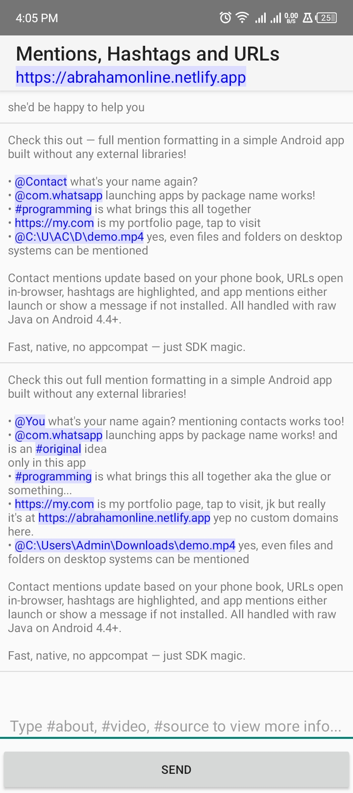

# Mentioning App

## Overview

This Android app demonstrates a lightweight and efficient way to support mentioning contacts, other apps, hashtags, and URLs within text inputs using Android spans. It allows users to mention other apps via their package names (e.g., `com.myapp.name`) using only Java, without relying on Kotlin, AppCompat libraries, or modern dependencies. This approach ensures a fast compilation time, lightweight runtime, and backward compatibility down to Android 4.4 KitKat.

## Features

- Mention contacts and other apps using `@keyword` syntax.
- Support for `#hashtags` and URLs within text.
- Recognizes and highlights mentions of other apps by their package names.
- Uses Android spans for rich text styling and interaction.
- Pure Java implementation without Kotlin or modern Android libraries.
- Backward compatible with Android 4.4 KitKat and above.

## Screenshots

## Technology

- Language: Java (no Kotlin)
- No AppCompat or modern Android libraries used
- Minimum SDK: Android 4.4 KitKat (API level 19)
- Uses Android spans for text styling and interaction

## Build, Run & Contribute

1. Open the project in Android Studio.
2. Build the project using Gradle.
3. Run the app on an emulator or physical device running Android 4.4 or higher.
4. For contributions or to report issues, visit the repository at: [https://github.com/abraham-ny/apktag](https://github.com/abraham-ny/apktag)

## Intellectual Property Notice

The app icon located in the `mipmap` directory is protected intellectual property/art by law and should not be used or distributed without proper authorization.

## License

This project is open source and available under the MIT License.

